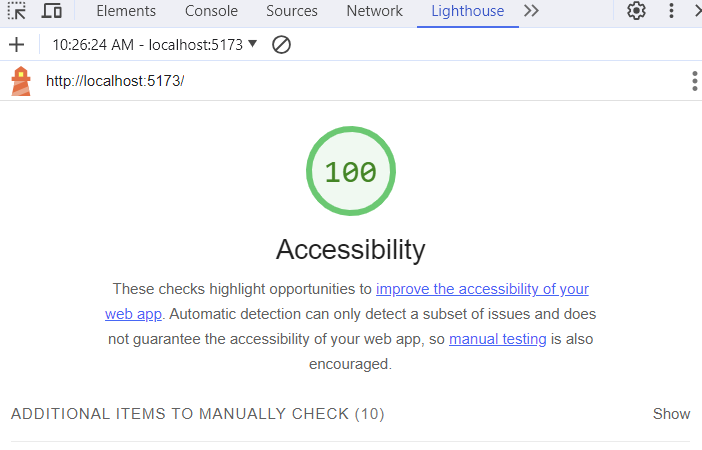

# Can of Books

**Author**: Melodic

**Version**: 1.0.0 (increment the patch/fix version number if you make more commits past your first submission)

## Overview

Application is built to render books to user that user is interested in reading, or in progress of reading, or has completed reading.

## Getting Started

### Requirements

For development, you will only need Node.js installed on your environment.
And please use the appropriate [Editorconfig](http://editorconfig.org/) plugin for your Editor (not mandatory).

#### Node

[Node](http://nodejs.org/) is really easy to install & now include [NPM](https://npmjs.org/).
You should be able to run the following command after the installation procedure
below.

    $ node --version
    v0.10.24

    $ npm --version
    1.3.21

### Install

    git clone https://github.com/ORG/PROJECT.git
    cd PROJECT
    npm install

### Configure app

Any environment configuration steps.

### Start & watch

    npm run dev
    npm start

### Simple build for production

    npm run build

## Architecture

### Languages & tools

    JavaScript, CSS, Axios, React, React-Bootstrap

### Lighthouse Scores

LightHouse Score 11-07-2023 

## Change Log

### 11-26-2023 301 - Lab 15

11-26-2023 8:00am - Add Auth0

Name of feature: Add Auth0 to application

Estimate of time needed to complete: 2 hours

Start time: 10:30 am

Finish time: 1:00 pm

Actual time needed to complete: 5 hours

### 11-25-2023 301 - Lab 15

11-25-2023 8:00am - Add Auth0

Name of feature: Add Auth0 to application

Estimate of time needed to complete: 2 hours

Start time: 10:00 am

Finish time: 1:00 pm

Actual time needed to complete:

### 11-16-2023 301 - Lab 13

11-16-2023 8:00am - Add update button that opens modal

Name of feature: Add modal to display from update button

Estimate of time needed to complete: 2 hours

Start time: 8:00 am

Finish time: 10:00 am

Actual time needed to complete: 2 hours

### 11-15-2023 301 - Lab 12

11-15-2023 8:00am - Add modal to display form

Name of feature: Add modal to display form

Estimate of time needed to complete: 2 hours

Start time: 8:00 am

Finish time: 10:00 am

Actual time needed to complete: 2 hours

### 11-14-2023 301 - Lab 12

11-14-2023 10:00am - Application can delete and add books to database

Name of feature: Render images from database with book images

Estimate of time needed to complete: 2 hours

Start time: 10:00 am

Finish time: 12:00 pm

Actual time needed to complete: 1 hours

### 11-7-2023 301 - Lab 11

11-4-2023 10:00am - Application can render books, images, and styling

Name of feature: Render images from database with book images

Estimate of time needed to complete: 2 hours

Start time: 9:00 am

Finish time: 10:00 am

Actual time needed to complete: 1 hours

### 11-4-2023 301 - Lab 11

11-4-2023 1:00pm - Application can render data and images in carousel format

Name of feature: Render images in carousel format from server

Estimate of time needed to complete: 2 hours

Start time: 10:00 am

Finish time: 1:00 pm

Actual time needed to complete: 3 hours

## Collaborators

ChatGPT
